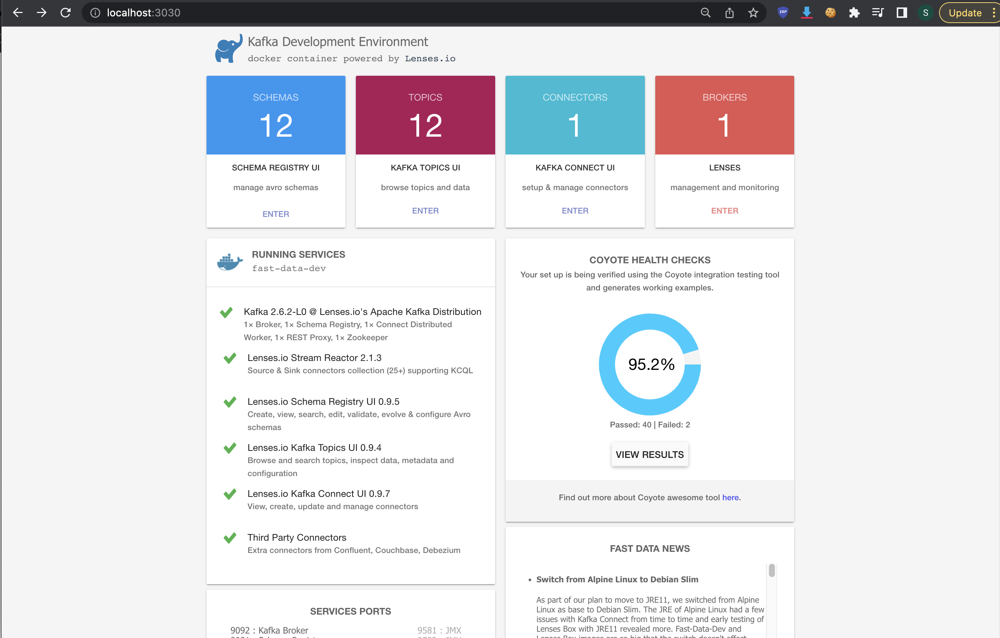
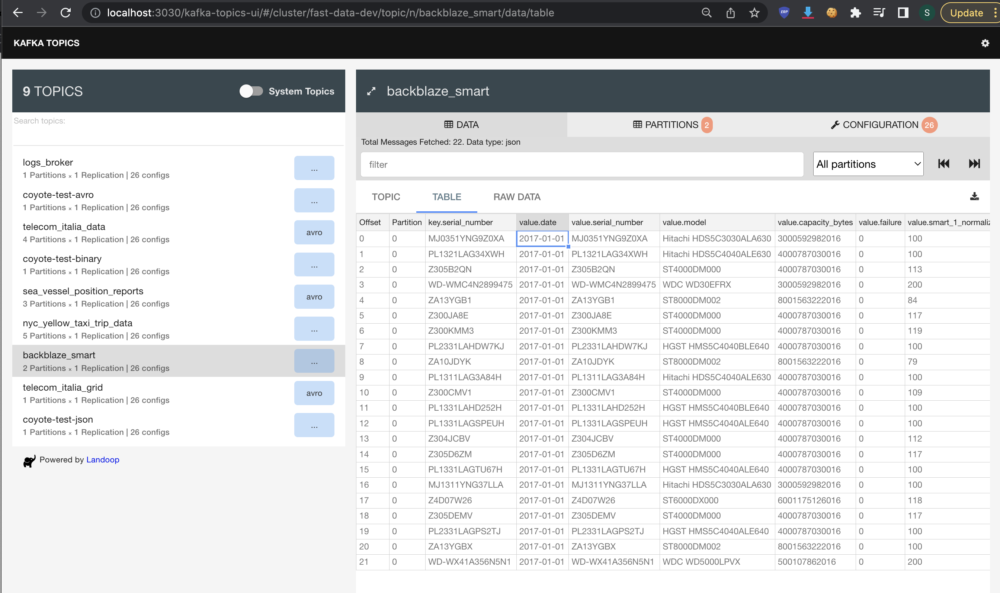

```sh
  docker compose up
```

#### delete ALL images
```
  docker system prune --all
```

```sh
  docker run --rm -p 2181:2181 -p 3030:3030 -p 8081-8083:8081-8083 -p 9581-9585:9581-9585 -p 9092:9092 -e ADV_HOST=localhost lensesio/fast-data-dev:latest
```

#### show logs for kafka service
```
  docker exec -it kafka tail -f /var/log/broker.log
```

#### schema
<ol>
9092 : Kafka Broker

9581 : JMX

8081 : Schema Registry

9582 : JMX

8082 : Kafka REST Proxy

9583 : JMX

8083 : Kafka Connect Distributed

9584 : JMX

2181 : ZooKeeper

9585 : JMX

3030 : Web Server
</ol>

##### start page

##### list Topic


### about that additional info:
1. https://kafka.apache.org/quickstart
2. https://www.youtube.com/watch?v=TRZkBnOKTic
3. https://hub.docker.com/r/landoop/fast-data-dev
